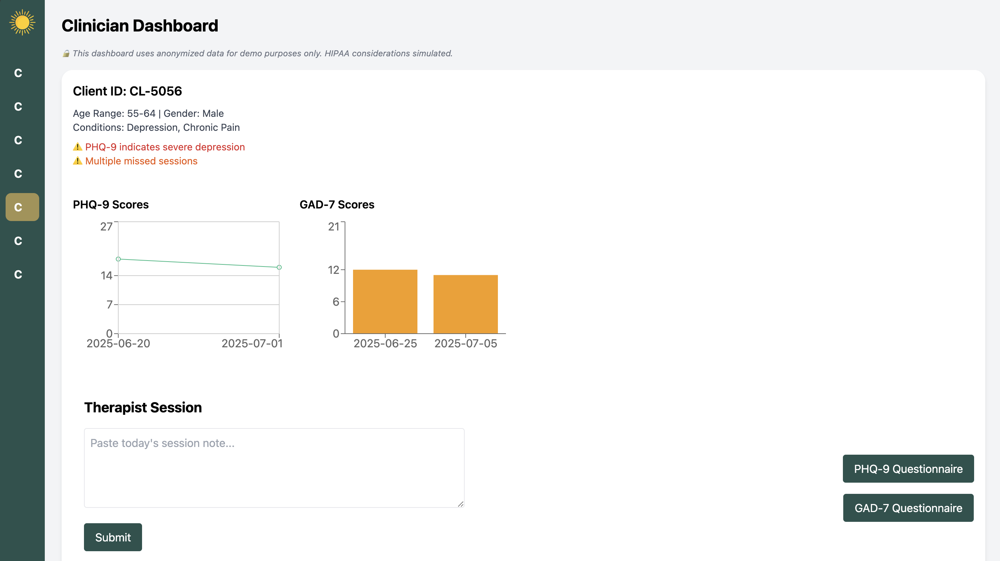
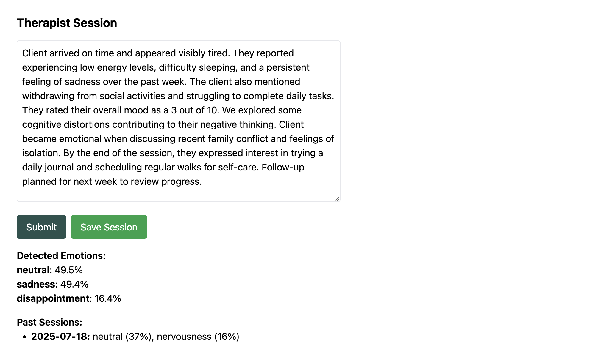

# Mental Health Insights Dashboard

A clinician-facing web dashboard that visualizes anonymized client mental health data (mood trends, PHQ-9, GAD-7 scores, and attendance) with simulated HIPAA-aware design principles. Built as a personal project to demonstrate applied skills in healthcare technology, data visualization, and secure design.

---

_The main dashboard view, showing client overviews, risk alerts, and trend charts._

---

## Features

- **Mood & symptom trend visualization** 
- **Risk alert system** for sudden changes or missed sessions
- **HIPAA-awareness by design** (no PII, secure design notes)
- **Modular component structure** using React + Tailwind CSS
- Uses **realistic synthetic patient data** (JSON-based)
- **Emotion Analysis Backend** using NLP (Natural Language Processing) to detect emotional tone in therapist notes. Read more in the [Backend README](https://github.com/marinspira/mental-health-insights-dashboard/blob/main/backend/README.md)

---

_The emotion analysis modal, which uses NLP to extract sentiment from clinical notes._

---

## Why This Project?

Mental health clinicians need quick, clear access to patient progress—without compromising privacy. This dashboard simulates a real-world tool that could be integrated into healthcare platforms, combining thoughtful UX, smart alerts, and HIPAA-aware architecture.

---

## HIPAA Awareness

| Principle              | How It’s Addressed                                  |
| ---------------------- | --------------------------------------------------- |
| No PII                 | Uses de-identified, synthetic data only             |
| Role-Based Access      | Login simulation with therapist ID                  |
| Minimum Necessary Info | Only essential health indicators and trends shown   |
| Security Banner        | “Demo only” disclaimer in UI and docs               |
| Future Proofing        | Code designed to support backend auth or encryption |

--- 

## Future Improvements

- Real authentication (probably JWT or OAuth)
- API backend (Node + MongoDB)
- Exportable clinician reports
- Data filtering by diagnosis, score range
- Accessibility audit (WCAG)